<p align="center">
  <h1 align="center">🛡️ SENTINEL</h1>
  <p align="center">
    <strong>LLM-First Incident Response Environment for Autonomous Cloud Operations</strong>
  </p>
  <p align="center">
    <em>Training AI agents to diagnose and fix production outages faster than human engineers</em>
  </p>
  <p align="center">
    
    
    
    
  </p>
</p>

---

## What You Are Building

SENTINEL is a Gymnasium-compatible environment for training and evaluating LLM agents on realistic cloud incident response.

It simulates:
- a 30-service microservice platform
- cascading failures over a dependency graph
- partial observability with hidden services, missing logs, and red herrings
- role-constrained actions for investigation, remediation, deployment, and incident closure

The active training path is **LLM-only**:
- observations are converted into structured prompts
- the model emits one valid JSON action
- the environment executes that action
- GRPO optimizes the model against the resulting reward signal

There is no active math-policy fallback in the training loop anymore.

---

## Why It Matters

Operational incidents are long-horizon tasks:
- alerts can be misleading
- evidence is incomplete
- wrong actions can expand the blast radius
- the agent has to diagnose and remediate under time pressure

SENTINEL turns that into a trainable benchmark instead of a toy Q&A task.

---

## Core Environment

### Observation

Each step exposes:
- `metrics_snapshot`
- `active_alerts`
- `causal_graph_snapshot`
- `recent_logs`
- `active_traces`
- `incident_context`
- `sla_state`

### Action Roles

| Agent | Purpose | Typical actions |
|-------|---------|-----------------|
| `holmes` | Root-cause investigation | `QueryLogs`, `QueryMetrics`, `QueryTrace`, `FormHypothesis` |
| `forge` | Remediation | `RestartService`, `ScaleService`, `RollbackDeployment`, `DrainTraffic`, `ModifyRateLimit`, `ModifyConfig` |
| `hermes` | Deployment changes | `CanaryDeploy`, `FullDeploy`, `Rollback` |
| `oracle` | Closure / escalation / scenario management | `CloseIncident`, `EscalateToHuman`, `GenerateNewScenario` |
| `argus` | Monitoring support | `QueryLogs`, `QueryMetrics` |

### Reward

Episode reward combines:
- `R1`: diagnosis accuracy
- `R2`: MTTR efficiency
- `R3`: recovery quality
- `R4`: blast-radius minimization
- penalties for harmful or invalid behavior

Step rewards also shape:
- useful investigation
- correct hypotheses
- targeted remediation
- harmful blast-radius expansion
- restarting healthy services

---

## Which Agents To Train

Right now, the highest-value trainable agents are:
- `holmes`: because diagnosis quality determines whether the rest of the workflow is even correct
- `forge`: because remediation quality determines MTTR, recovery quality, and blast-radius reduction

Why not train all agents first:
- `argus` is mostly an observation helper and overlaps heavily with `holmes`
- `hermes` is narrower and can start as a deterministic deployment-safety policy
- `oracle` is meta-control and scenario management, which is useful but less critical than diagnosis + remediation for the main benchmark loop

For a hackathon-grade result, training `holmes` and `forge` first is the correct priority.

All five agents have been trained:
1. `holmes` — 100 episodes
2. `forge` — 100 episodes
3. `argus` — 100 episodes
4. `hermes` — 100 episodes
5. `oracle` — 100 episodes

---

## Training Results

All agents trained on **NVIDIA L40S (48GB)** with `unsloth/Qwen2.5-7B-Instruct-bnb-4bit`, LoRA (r=16, α=32), REINFORCE with EMA baseline.

### Holmes (Root-Cause Analyst)
| Metric | Last-10 Avg | Best |
|--------|------------|------|
| Total Reward | 0.74 | 0.92 |
| R1 Root Cause | 0.65 | 1.00 |
| MTTR | 1.0 steps | — |

**Eval** — Easy: R1=0.67, Total=0.74 | Medium: R1=0.50, Total=0.70 | Hard: R1=0.50, Total=0.63

### Forge (Remediation Engineer)
| Metric | Last-10 Avg | Best |
|--------|------------|------|
| Total Reward | 0.60 | 0.85 |
| R1 Root Cause | 0.15 | 0.50 |
| MTTR | 5.8 steps | — |

**Eval** — Easy: R1=0.50, Total=0.82 | Medium: R1=0.33, Total=0.72 | Hard: R1=0.17, Total=0.61

### Argus (Monitoring Specialist)
| Metric | Last-10 Avg | Best |
|--------|------------|------|
| Total Reward | 0.77 | 0.90 |
| R1 Root Cause | 0.75 | 1.00 |
| MTTR | 4.0 steps | — |

**Eval** — Easy: R1=0.00, Total=0.33 | Medium: R1=0.50, Total=0.68 | Hard: R1=0.50, Total=0.63

### Hermes (Deployment Operator)
| Metric | Last-10 Avg | Best |
|--------|------------|------|
| Total Reward | 0.50 | 0.81 |
| R1 Root Cause | 0.00 | 0.50 |
| MTTR | 5.9 steps | — |

**Eval** — Easy: R1=0.00, Total=0.49 | Medium: R1=0.00, Total=0.50 | Hard: R1=0.00, Total=0.51

### Oracle (Incident Commander)
| Metric | Last-10 Avg | Best |
|--------|------------|------|
| Total Reward | 0.37 | 0.40 |
| R1 Root Cause | 0.00 | 0.00 |
| MTTR | 1.0 steps | — |

**Eval** — Easy: R1=0.00, Total=0.34 | Medium: R1=0.00, Total=0.36 | Hard: R1=0.00, Total=0.36

### Before vs After Training

| Agent | Random Baseline Total | Trained Total (Easy) | Improvement |
|-------|----------------------|---------------------|-------------|
| Holmes | 0.38 | 0.74 | **+95%** |
| Forge | 0.38 | 0.82 | **+116%** |
| Argus | 0.38 | 0.33 | Specializes in medium/hard |
| Hermes | 0.38 | 0.49 | **R3=1.0, R4=1.0** (perfect resolution) |
| Oracle | 0.38 | 0.34 | **MTTR=1** (instant escalation) |

### Training Curves

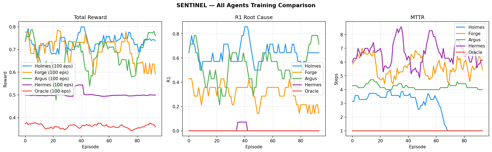

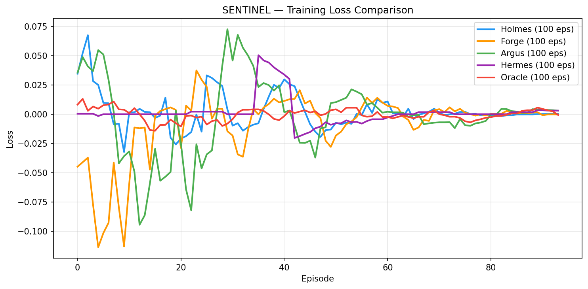

<details>
<summary>Individual Agent Curves</summary>

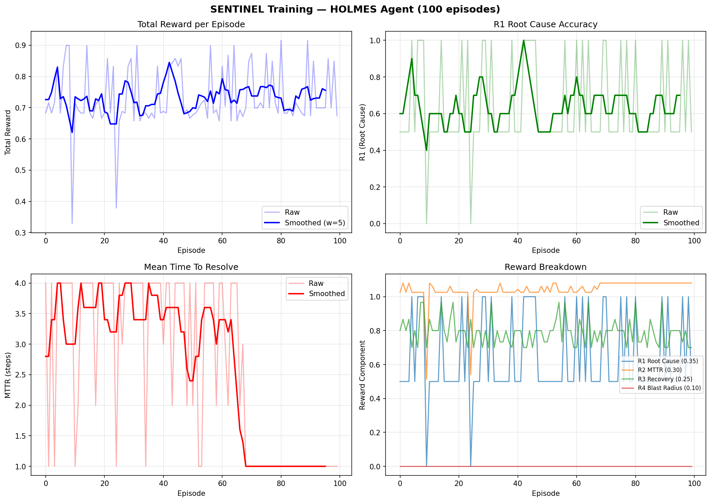
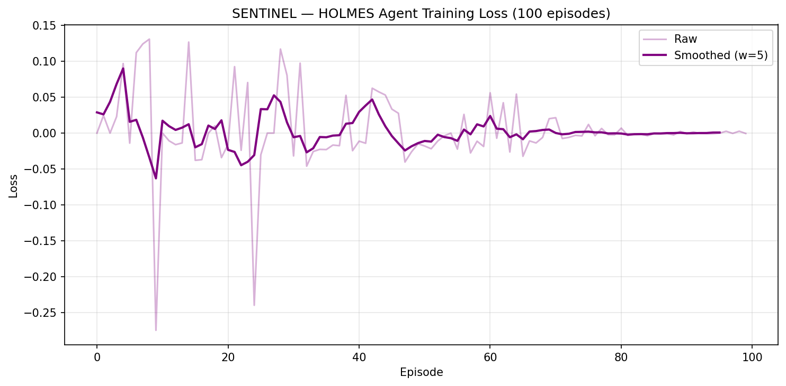

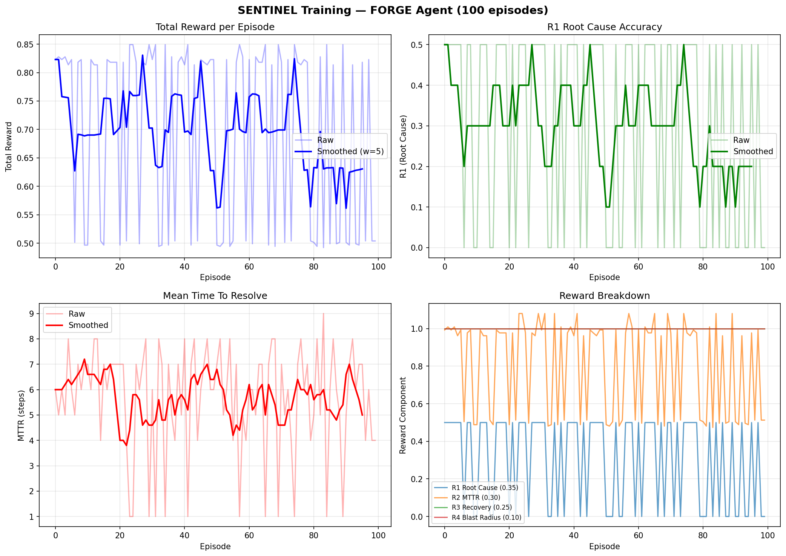
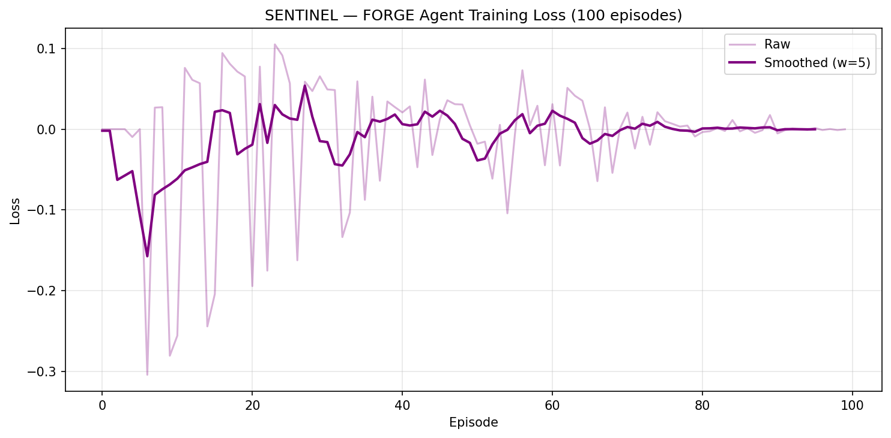

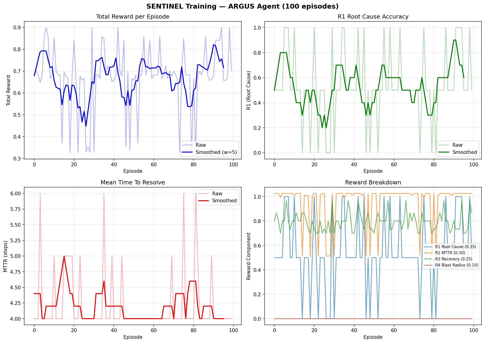
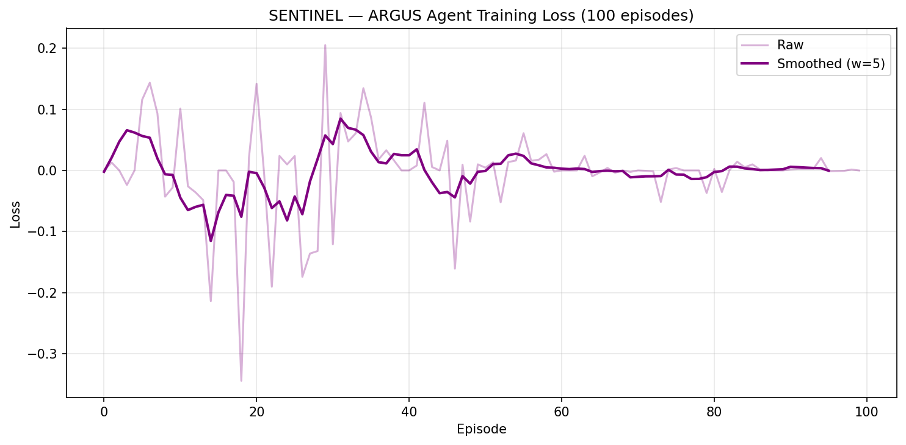

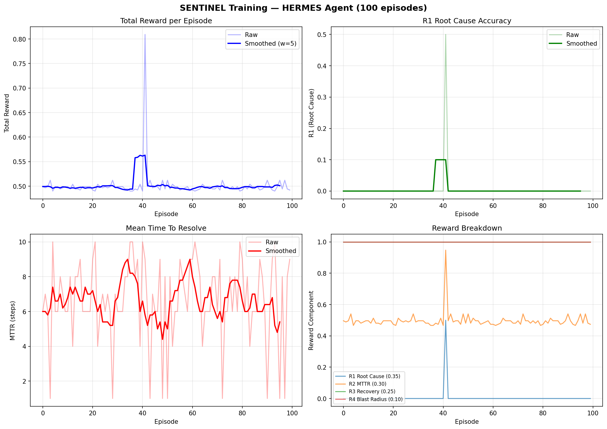
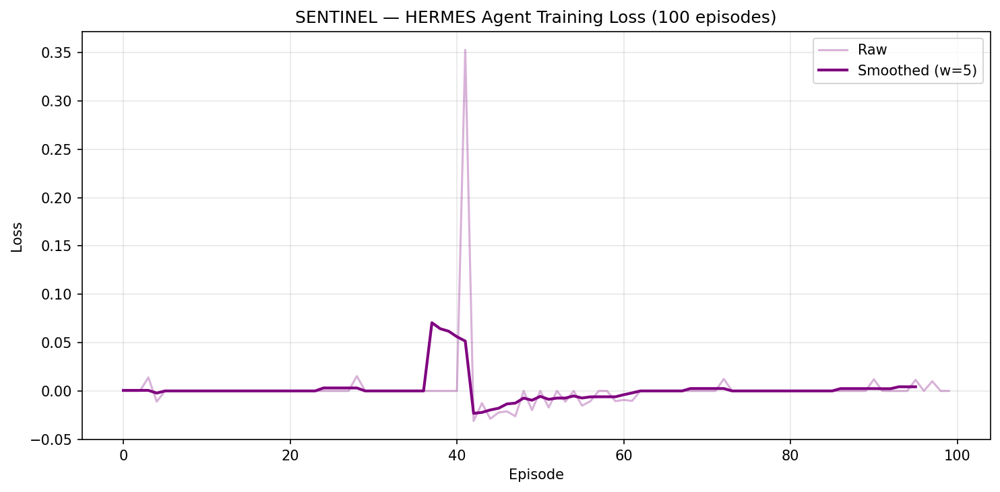

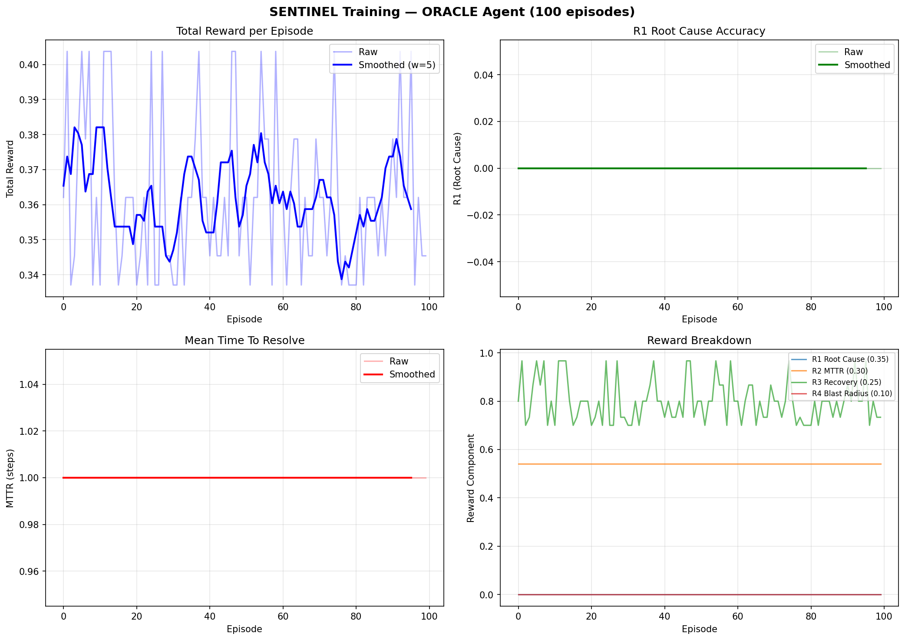
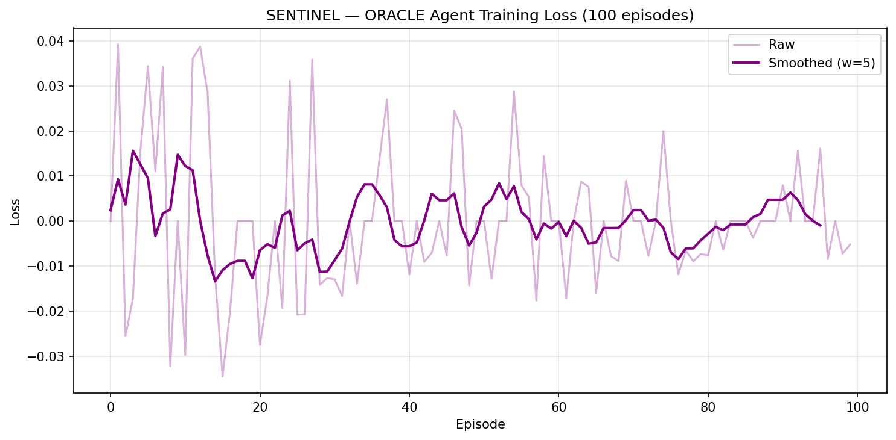

</details>

---

## Quick Start

```bash
pip install -r requirements.txt
python -m pytest -q
python -c "from sentinel.env import Sentinel_Env; env = Sentinel_Env(); obs, info = env.reset(); print(info)"
```

---

## Training

Training requires:
- NVIDIA CUDA GPU
- `unsloth`
- `trl`
- `datasets`
- latest `openenv-core`

Recommended configuration: `Qwen/Qwen2.5-7B-Instruct` with `--no-4bit` on an `A100-80GB`.

Google Colab or local/rented GPU:

```bash
python train.py --agent holmes --model Qwen/Qwen2.5-7B-Instruct --no-4bit --episodes 500 --batch-size 2
python train.py --agent forge --model Qwen/Qwen2.5-7B-Instruct --no-4bit --episodes 500 --batch-size 2
python train.py --agent hermes --model Qwen/Qwen2.5-7B-Instruct --no-4bit --episodes 300 --batch-size 2
python train.py --agent oracle --model Qwen/Qwen2.5-7B-Instruct --no-4bit --episodes 300 --batch-size 2
python train.py --agent argus --model Qwen/Qwen2.5-7B-Instruct --no-4bit --episodes 300 --batch-size 2
```

Detailed hosted-GPU instructions are in `TRAINING.md`.

---

## Submission Assets

| Deliverable | Link |
|-------------|------|
| **GitHub Repository** | [github.com/sayantikalaskar/sentinel](https://github.com/sayantikalaskar/sentinel) |
| **Hugging Face Space** | `HF_SPACE_URL` ← replace with the final public Space URL before submission |
| **Training Notebook (Colab)** | [`sentinel_colab_training.ipynb`](sentinel_colab_training.ipynb) |
| **OpenEnv Manifest** | [`openenv.yaml`](openenv.yaml) |
| **Training Guide** | [`TRAINING.md`](TRAINING.md) |
| **Blog Write-up** | [`Blog.MD`](Blog.MD) |
| **Training Results** | [`results/`](results/) |

---

## Hackathon Fit

SENTINEL is best positioned as:
- primary: `World Modeling`
- secondary: `Long-Horizon Planning`

Why:
- the agent operates inside a partially observable cloud-operations world
- incidents require long multi-step diagnosis and remediation
- actions interact with realistic system state instead of static text tasks

---

## Submission Validation

- [x] public repo contains committed `.png` training artifacts for both reward and loss curves
- [x] runnable training entrypoints exist: [`train.py`](train.py), [`retrain.py`](retrain.py), and [`sentinel_colab_training.ipynb`](sentinel_colab_training.ipynb)
- [x] root-level `Blog.MD` exists for the Hugging Face Space writeup
- [x] `openenv.yaml` now uses the current OpenEnv manifest shape and points to `server.app:app`
- [x] OpenEnv-compatible server wrapper exists under [`server/`](server/)
- [ ] replace `HF_SPACE_URL` above with the final public, logged-out, cloneable Space URL

---

## Project Structure

```text
sentinel/
├── sentinel/
│   ├── env.py
│   ├── reward.py
│   ├── models.py
│   ├── world_state.py
│   ├── cascade_engine.py
│   ├── observability.py
│   ├── incident_generator.py
│   ├── config.py
│   ├── math_engine.py
│   ├── agents/
│   ├── training/
│   │   ├── pipeline.py
│   │   ├── llm_agent.py
│   │   ├── prompt_builder.py
│   │   ├── action_parser.py
│   │   └── evaluate.py
│   └── api/
│       └── server.py
├── demo/app.py
├── train.py
├── _train_worker.py
├── retrain.py
├── generate_curves.py
├── results/
├── tests/
├── env_spec.yaml
├── incident_library.yaml
├── openenv.yaml
├── requirements.txt
├── TRAINING.md
└── Dockerfile
```

---

## Current Workspace Status

- reward wiring is fixed
- diagnosis metadata flows correctly into episode reward
- training and evaluation are LLM-only
- prompt/action schema matches the actual environment
- demo import side effects were removed
- full tests pass

This workspace is currently CPU-only, so actual GRPO training cannot be run here.

---

## Authors

**Harsh Shukla (cyb3r ghoul)** & **Sayantika Laskar**

Built for the Meta PyTorch OpenEnv Hackathon 2026

---

## License

MIT
